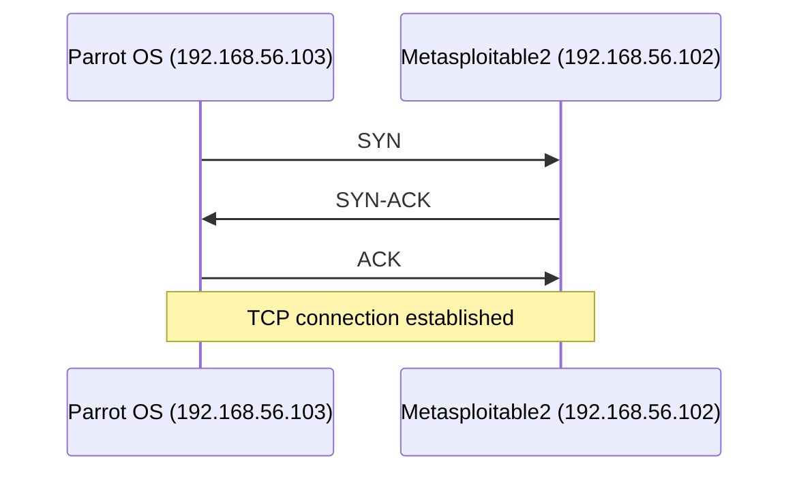

# TCP Three-way handshake 

```mermaid
sequenceDiagram
    participant P as Parrot OS (192.168.56.103)
    participant M as Metasploitable2 (192.168.56.102)

    P->>M: SYN
    M->>P: SYN-ACK
    P->>M: ACK
Note over P,M: TCP connection established
``` 
    
