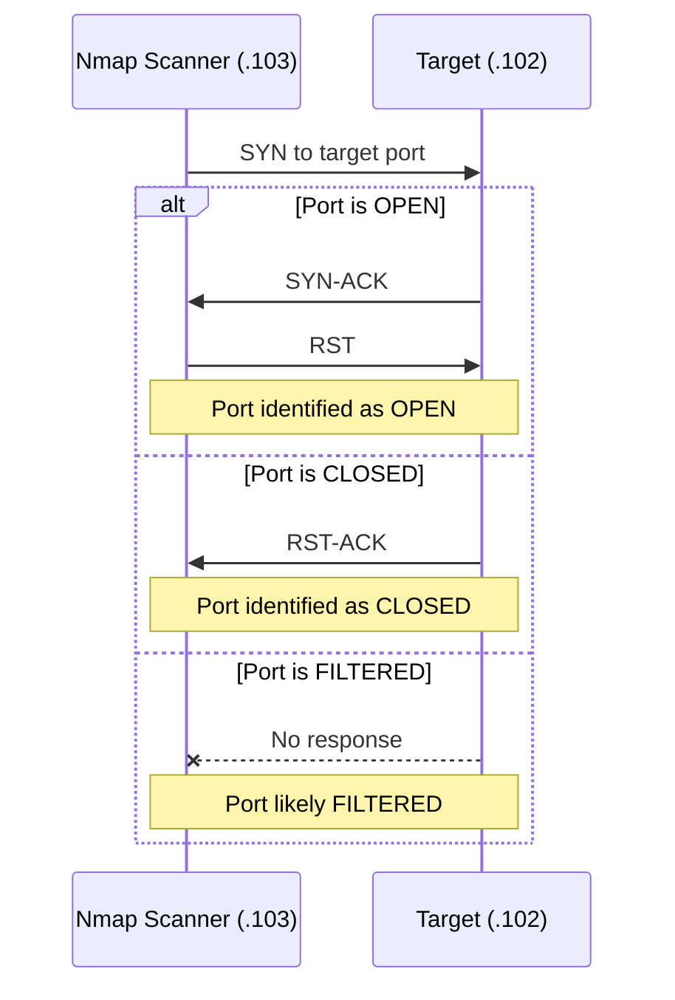

# Port scanning

```mermaid
sequenceDiagram
    participant N as Nmap Scanner (.103)
    participant T as Target (.102)

    N->>T: SYN to target port

    alt Port is OPEN
        T->>N: SYN-ACK
        N->>T: RST
        Note over N,T: Port identified as OPEN
    else Port is CLOSED
        T->>N: RST-ACK
        Note over N,T: Port identified as CLOSED
    else Port is FILTERED
        T--xN: No response
        Note over N,T: Port likely FILTERED
   end
``` 
